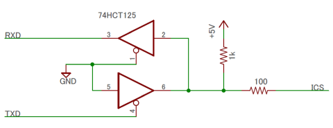

ICS Servo Library for Arduino
=========

## 概要
近藤科学のシリアルサーボ規格 ICS に対応したArduino用ライブラリです。

## 対応規格
近藤科学 ICS 3.5準拠
* ただし、通信速度は115200bpsのみ対応。
* ICSの詳細について近藤科学のWEBサイトを参照してください。

## 対応ボード
115200bpsのシリアル通信が可能なArduinoおよび互換ボード
* Arduino UNO および GR-CITRUSで動作確認済み。
* 3.3V版Arduino Pro Mini などは115200bpsが使用できないので不可。
* HardwareSerialクラスおよびmicros()関数に依存。

## 接続
下図のような回路でArduinoのシリアルポートに接続します。

* ロジックの電圧は5Vです。(3.3Vでも動作するかもしれませんが…)
* 3.3V系マイコンに接続する場合は5Vトレラントのポートに接続してください。
* 74HC125でも動作しますが、3.3V系マイコンの場合は74HCT125を使うべきです。
* 5Vトレラントのポートが無いなら、適宜レベル変換をおこなってください。

## インストール
ICSフォルダをArduinoのライブラリフォルダの下にコピーします。
* Windows7 では %USERPROFILE%\My Documents\Arduino\libraries です。
* Windows10 では %USERPROFILE%\Documents\Arduino\libraries です。

## サンプルスケッチ
* ICS_SyncDemo 同期APIのサンプル
* ICS_AsyncDemo 非同期APIのサンプル

